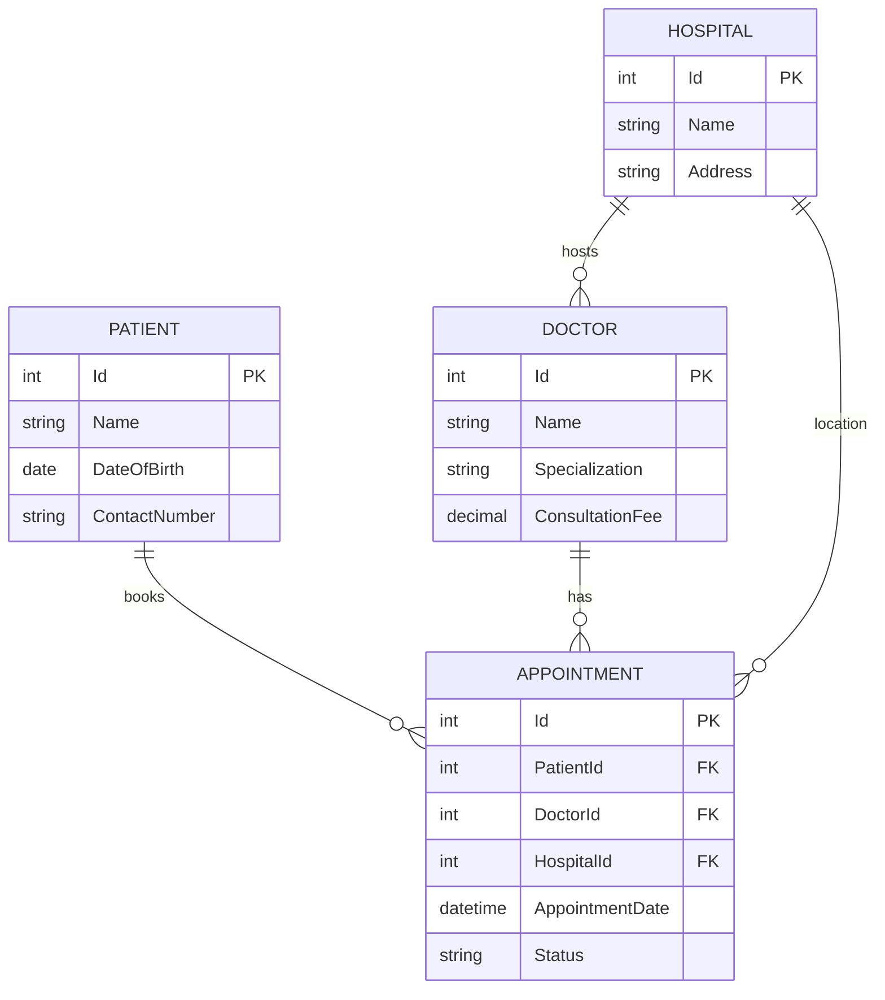

# High Level Design - Durdans Razor MVP (Current Scope)

This document outlines the high-level architecture and technical implementation for the "Current Scope" of the Durdans Hospital Clinic Management System using **ASP.NET Core Razor Pages**.

## 1. Technology Stack

| Component | Technology | Reason |
| :--- | :--- | :--- |
| **Framework** | .NET 8.0 (ASP.NET Core) | Modern, high-performance, cross-platform framework. |
| **Frontend** | Razor Pages + Bootstrap 5 | Page-focused programming model, easy to build and maintain. |
| **Language** | C# | Strongly typed, object-oriented backend language. |
| **Database** | Microsoft SQL Server | Reliable relational database management system. |
| **Data Access** | Entity Framework Core (EF Core) | ORM for efficient data access and type safety. |
| **Dependency Injection** | Built-in .NET Core DI | Loosely coupled architecture for better testability. |

## 2. System Architecture

The system follows a **Clean Architecture** approach adapted for Razor Pages:

```mermaid
graph TD
    subgraph "Presentation Layer (UI)"
        RP[Razor Pages (.cshtml)]
        PM[PageModels (.cshtml.cs)]
    end

    subgraph "Business Logic Layer (BLL)"
        Service[Service Classes]
        Interface[Service Interfaces]
    end

    subgraph "Data Access Layer (DAL)"
        Repo[Repositories]
        DbContext[EF Core DbContext]
    end

    subgraph "Database"
        SQL[(SQL Server)]
    end

    %% Data Flow
    RP <-->|Bind Properties| PM
    PM -->|Injects| Interface
    Interface <-->|Implement| Service
    Service -->|Uses| Repo
    Repo -->|Uses| DbContext
    DbContext <-->|Reads/Writes| SQL
```

## 3. Core Modules & Technical Implementation

### 3.1 Patient Management
*   **Pages**: `Pages/Patients/Register`, `Pages/Patients/Index` (List/Search), `Pages/Patients/Edit`.
*   **Data Access**: `PatientRepository` using EF Core to CRUD `Patients` table.
*   **Key Features**:
    *   Server-side validation using Data Annotations (`[Required]`, `[Phone]`).
    *   Tag Helpers for form binding (`asp-for`).

### 3.2 Doctor Management
*   **Pages**: `Pages/Doctors/Create`, `Pages/Doctors/Index`, `Pages/Doctors/Edit`.
*   **Data Access**: `DoctorRepository` managing `Doctors` table.
*   **Key Features**:
    *   **Availability**: Stored as structured data (e.g., JSON or related table) linked to Doctor ID.
    *   **Hospital Association**: Many-to-Many relationship managed via EF Core.

### 3.3 Hospital Management
*   **Pages**: `Pages/Hospitals/Create`, `Pages/Hospitals/Index`.
*   **Data Access**: `HospitalRepository` for `Hospitals` table.
*   **Key Features**:
    *   Simple CRUD operations.
    *   Dropdown population for Doctor registration.

### 3.4 Appointment Management
*   **Pages**: `Pages/Appointments/Book`, `Pages/Appointments/Index`.
*   **Data Access**: `AppointmentRepository` handling `Appointments` table.
*   **Key Features**:
    *   **Search Logic**: LINQ queries in `DoctorService` to filter by Specialization/Hospital/Date.
    *   **Booking Transaction**: `DbContext.Database.BeginTransaction()` to ensure atomicity when booking.
    *   **Concurrency**: Optimistic concurrency handling for double-booking prevention.

## 4. Entity Relationships (ERD)


