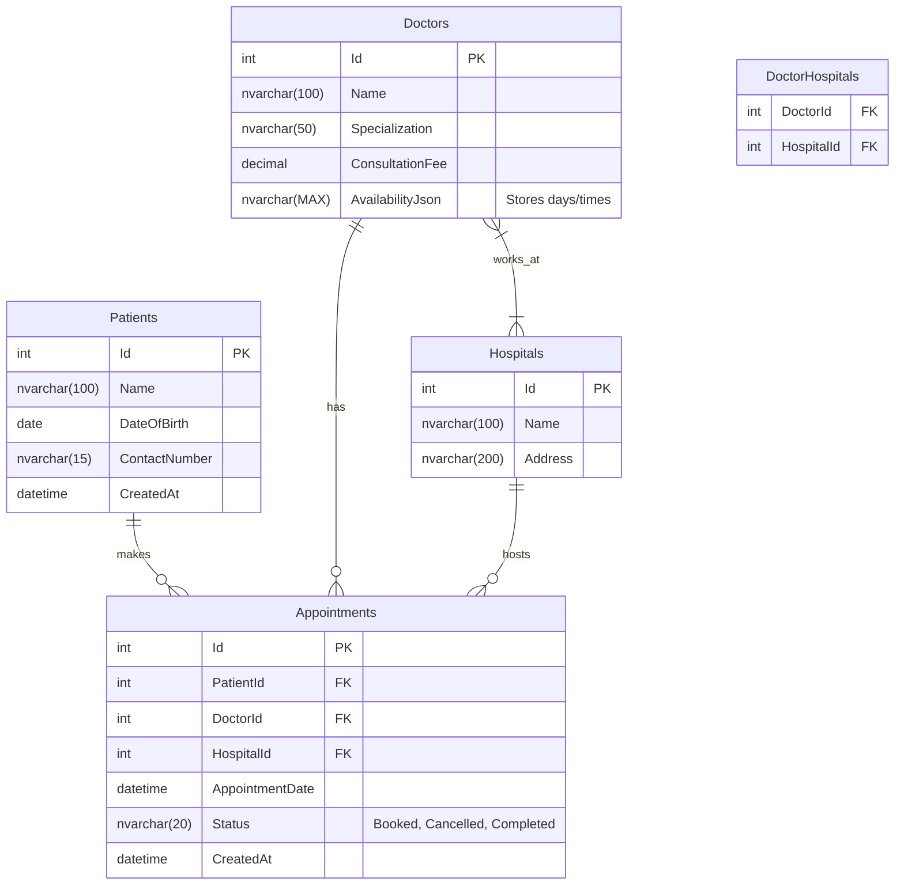
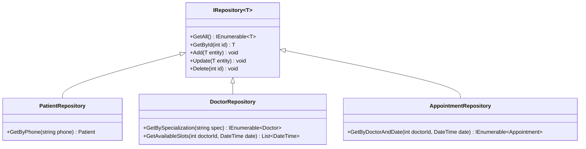

# Low Level Design - Durdans Razor MVP (Current Scope)

This document provides the detailed class design, database schema, and method signatures for the Durdans Hospital Clinic Management System (Razor Pages).

## 1. Database Schema (SQL Server)



## 2. Class Design (Backend)

### 2.1 Domain Models

```csharp
public class Patient {
    public int Id { get; set; }
    [Required] public string Name { get; set; }
    public DateTime DateOfBirth { get; set; }
    [Phone] public string ContactNumber { get; set; }
}

public class Doctor {
    public int Id { get; set; }
    public string Name { get; set; }
    public string Specialization { get; set; }
    public decimal ConsultationFee { get; set; }
    public List<Hospital> Hospitals { get; set; } // Many-to-Many
}

public class Hospital {
    public int Id { get; set; }
    public string Name { get; set; }
    public string Address { get; set; }
    public List<Doctor> Doctors { get; set; }
}

public class Appointment {
    public int Id { get; set; }
    public int PatientId { get; set; }
    public int DoctorId { get; set; }
    public int HospitalId { get; set; }
    public DateTime AppointmentDate { get; set; }
    public string Status { get; set; }
}
```

### 2.2 Data Access Layer (Repositories)



### 2.3 Business Logic Layer (Services)

*   **AppointmentService**
    *   `BookAppointment(AppointmentDto dto)`: Validates availability, checks for double booking, saves to DB.
    *   `GetAvailableSlots(int doctorId, int hospitalId, DateTime date)`: Returns list of free time slots.

## 3. Razor Pages Design (UI Layer)

### 3.1 Patient Pages

*   **Register (`/Patients/Register`)**
    *   `OnGet()`: Returns empty form.
    *   `OnPost()`:
        1.  Validates `ModelState`.
        2.  Calls `PatientRepository.Add()`.
        3.  Redirects to Index.

### 3.2 Appointment Pages

*   **Book (`/Appointments/Book`)**
    *   `OnGet()`: Loads Dropdowns (Specializations, Hospitals).
    *   `OnGetDoctors(string specialization)`: AJAX handler to fetch doctors.
    *   `OnPost()`:
        1.  Validates selection.
        2.  Calls `AppointmentService.BookAppointment()`.
        3.  Returns Success/Failure message.

### 3.3 Hospital Pages

*   **Create (`/Hospitals/Create`)**
    *   `OnPost()`: Adds new hospital.

## 4. API Endpoints (Optional for AJAX)

If using AJAX for dynamic dropdowns:
*   `GET /api/doctors?specialization={spec}`
*   `GET /api/slots?doctor={id}&date={date}`
